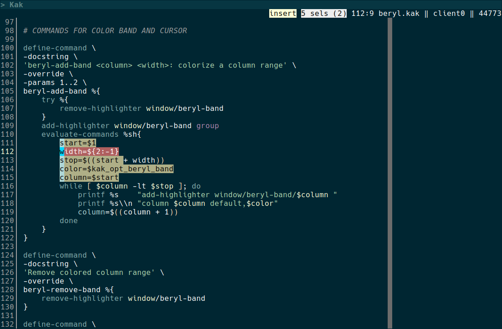
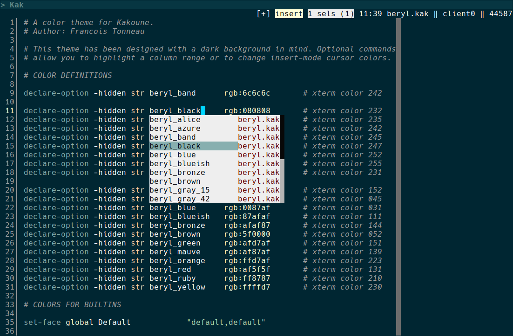
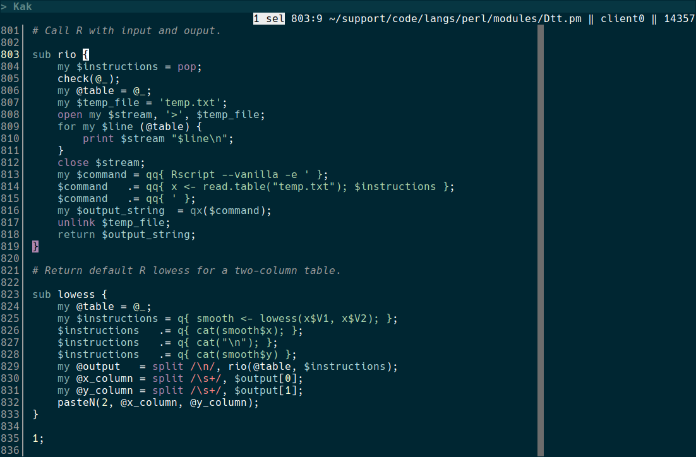

# beryl.kak

A Kakoune color theme in the Oceanic lineage.

This theme has been designed with a dark background in mind, but makes no attempt to change your
default background and foreground. Which background color will be used is therefore up to your
terminal settings. In the screenshots below, for example, the Hex value of the background is
#002632.

Six optional commands allow you to customize the theme:

- `beryl-add-band <column> <width>` displays a vertical color band at text column `<column>`. If
present, the `<width>` parameter specifies how many columns should be highlighted. If omitted, the
color band will be 1-column wide.

- `beryl-remove-band` removes the color band.

- `beryl-vivify-cursor` changes cursor colors for brighter ones.

- `beryl-dampen-cursor` changes cursor colors for dimmer ones.

- `beryl-enable-changing-cursor` will call `beryl-vivify-cursor` and `beryl-dampen-cursor` when
entering and leaving Insert mode, respectively.

- `beryl-disable-changing-cursor` disables cursor-color changes. The cursor will show dim colors at
all times.

## Screenshots

Multiple selections in Insert mode:

Edition with the autocompletion menu:

Perl example with the _show-matching_ highlighter:

## Tips

If you want Beryl to be your default color theme, add the following line:

    colorscheme beryl

to your `kakrc`.

If you want cursor colors to change when alternating between Insert and Normal mode, include
these lines:

    beryl-dampen-cursor
    beryl-enable-changing-cursor

in a hook dependent on the `WinCreate .*` event. For example, add the following to your `kakrc`:

    hook global WinCreate .* %{
        beryl-dampen-cursor
        beryl-enable-changing-cursor
    }

The `beryl-dampen-cursor` command guarantees that cursor colors when starting to edit the buffer are
the dimmer ones. From there, `beryl-enable-changing-cursor` takes care of color alternation.

## Warning

Some versions of Kakoune may crash when a wide character (e.g., a Bopomofo glyph) overlaps with a
highlighted text column. Use `beryl-add-band` with caution.

## Installation

Copy `beryl.kak` to your `$HOME/.config/kak/colors` directory.

Once in Kakoune, use the `:colorscheme` command to pick Beryl as a color theme, or adjust your
`kakrc` as suggested above.

## License

MIT

